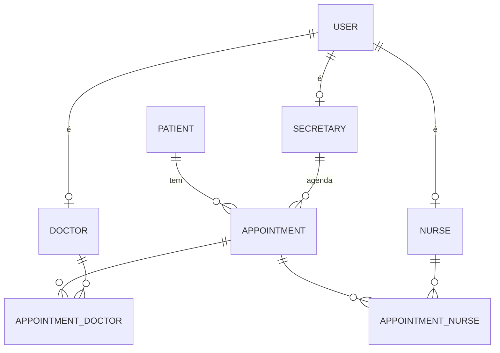

# Sustema: API de Gestão Hospitalar

[](https://github.com/JorgeBublitz/Sustema_NodeJs/actions/workflows/ci.yml)


API REST para a rotina de um hospital: usuários com papéis diferentes (administração, recepção, médicos e enfermagem), cadastro de pacientes e agendamento de consultas e cirurgias com equipes de vários profissionais.

## Destaques técnicos

- **Controle de acesso por papel (RBAC)** com quatro perfis: `ADMIN`, `SECRETARY`, `DOCTOR` e `NURSE`.
- **Modelagem relacional com 8 tabelas**, incluindo tabelas de junção para agendamentos com vários médicos e enfermeiros, e validação de CRM e COREN únicos por estado.
- **Criação de usuário em transação**: o usuário e o perfil profissional dele (médico, enfermeiro ou secretária) são criados juntos. Quando o papel muda, o perfil antigo é substituído na mesma transação.
- **Factory de controllers CRUD** genérica, compartilhada por seis recursos.
- **Validação com Zod**, e-mails normalizados e senhas com bcrypt que nunca aparecem nas respostas.
- **Tratamento global de erros**: duplicidade retorna `409`, registro inexistente `404`, referência inválida `400` e JSON malformado `400`.
- **TypeScript em modo `strict`**, ESLint e **testes de integração** (Vitest + Supertest) contra PostgreSQL real no **GitHub Actions**.

## Stack

| Camada | Tecnologias |
| --- | --- |
| Runtime e linguagem | Node.js, TypeScript |
| Framework | Express 5 |
| Banco de dados | PostgreSQL com Prisma ORM |
| Validação | Zod |
| Segurança | JWT, bcrypt, Helmet, express-rate-limit, CORS |
| Qualidade | Vitest, Supertest, ESLint, GitHub Actions |

## Modelo de dados



## Endpoints e permissões

Todas as rotas ficam sob `/api` e exigem `Authorization: Bearer <token>`, exceto o login. Cada recurso tem `GET /`, `GET /:id`, `POST /`, `PUT /:id` e `DELETE /:id`.

| Recurso | Leitura | Escrita |
| --- | --- | --- |
| `POST /auth/login` · `GET /auth/me` | pública / autenticado | |
| `/user` | ADMIN | ADMIN |
| `/doctor` · `/nurse` · `/secretary` | autenticado | ADMIN |
| `/pacient` | autenticado | ADMIN, SECRETARY |
| `/appointment` | autenticado | ADMIN, SECRETARY |

Exemplo: criar um médico com os dados do CRM.

```bash
curl -X POST http://localhost:3000/api/user \
  -H "Authorization: Bearer <token de ADMIN>" \
  -H "Content-Type: application/json" \
  -d '{
    "name": "Dr. Gregory", "age": 45, "gender": "MALE",
    "email": "gregory@hospital.com", "password": "senha123", "role": "DOCTOR",
    "doctorData": { "crmNumber": "12345", "crmState": "PB", "specialty": "Cardiologia", "department": "SURGERY" }
  }'
```

Exemplo: agendar uma cirurgia com dois médicos e um enfermeiro.

```bash
curl -X POST http://localhost:3000/api/appointment \
  -H "Authorization: Bearer <token>" \
  -H "Content-Type: application/json" \
  -d '{ "dateTime": "2026-11-10T09:00:00Z", "patientId": 1, "doctorIds": [1, 2], "nurseIds": [1], "notes": "Cirurgia cardíaca" }'
```

## Como rodar localmente

**Pré-requisitos:** Node.js 20 ou superior e um PostgreSQL acessível.

```bash
git clone https://github.com/JorgeBublitz/Sustema_NodeJs.git
cd Sustema_NodeJs
npm install                  # também gera o Prisma Client em src/generated
cp .env.example .env         # preencha DATABASE_URL e JWT_SECRET
npx prisma migrate deploy    # cria as tabelas
npm run seed                 # dados de exemplo
npm run dev                  # http://localhost:3000/api
```

O seed cria usuários de todos os papéis com a senha `123456`, por exemplo `admin@example.com`, `doctor1@example.com` e `secretary1@example.com`.

## Scripts

| Comando | O que faz |
| --- | --- |
| `npm run dev` | Servidor com recarga automática |
| `npm test` | Testes de integração (limpa o banco do `DATABASE_URL`; use um banco só para testes) |
| `npm run lint` / `npm run typecheck` | ESLint e checagem de tipos |
| `npm run build` / `npm start` | Build de produção e execução |
| `npm run seed` | Popula o banco com dados de exemplo |

## Estrutura

```
src/
├── routes/        # Rotas e permissões por papel
├── controllers/   # Factory CRUD e controllers de cada recurso
├── services/      # Regras de negócio e transações
├── schemas/       # Schemas Zod
├── middlewares/   # Autenticação, autorização, validação e erros
├── utils/         # Remoção de senha das respostas e erros HTTP
├── app.ts         # Configuração do Express
└── server.ts      # Inicialização do servidor
```

## Licença

MIT
